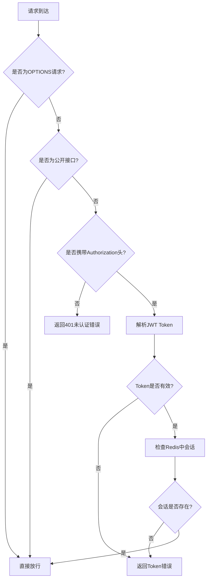

# 博客项目开发笔记 📝

> 🛠️ **开发提示**: 开发时使用1-3的那个前端文件，不要用上线的，因为后面对项目，数据库的表都有优化。

---

## 1. 前置知识 ⚙️

- Spring Boot
- Spring MVC
- MyBatis Plus 或者 MyBatis，我个人用的是MyBatis实现对应接口

> 💡 **小贴士**: 这样基本能做到看了接口文档需求自己实现对应的功能。  
> 比一味的抄代码效率和体验好很多。

---

## 2. 项目配置相关 🔧

1. 使用老师的JDK版本和对应版本的依赖项
2. 包、类的路径注意和扫描的路径相同（mapper.xml映射的时候）
3. 确保MyBatis配置正确，mapper-locations路径与实际文件路径一致

---

## 3. JWT相关 🔐

1. 使用jwt工具类创建jwt的token令牌
2. ⚠️ **重要提醒**: 注意直接给数据库插入用户账密数据的时候，回车键也会被插入（找了半个小时，我还以为是加密出错了）

---

## 4. 拦截器配置相关 🚧

### 4.1 创建拦截器
创建拦截器类，实现HandlerInterceptor接口

### 4.2 注册拦截器
在WebMvcConfig中注册拦截器

### 4.3 实现拦截逻辑

#### 处理OPTIONS预检请求
```java
if ("OPTIONS".equalsIgnoreCase(request.getMethod())) {
    return true;
}
```

✅ **添加了必要的依赖注入**:
- 注入了JWTUtils用于JWT token验证
- 注入了RedisTemplate用于检查Redis中的用户信息

✅ **完善了token验证逻辑**:
- 不仅验证JWT token的有效性，还检查Redis中是否存在对应的用户信息
- 这样可以确保用户登录后、登出前才能访问受保护的资源
- 如果用户已登出（Redis中的token被删除），即使JWT token本身有效也无法访问

✅ **添加了@Component注解**:
- 使拦截器能够通过Spring进行依赖注入

---

## 5. 登录相关 🔒

1. 登录时候获取用户信息，创建一个currentUser方法，接收token参数
2. 从客户端发送的HTTP请求头中获取名为Authorization的字段值，并将其作为token参数传入currentUser方法中，获取用户信息并返回给前端。注意WebMvcConfig配置中跨域配置，允许跨域请求
3. 创建LoginInterceptor拦截器并在WebMvcConfig注册
4. ✅ **注意放行以下请求路径**:
   - `/login/**`
   - `/articles/**` 和 `/articles`
   - `/tags/hot`
   - `/users/currentUser`
   - `/register`

---

## 6. 跨域配置 🌐

在WebMvcConfig中配置CORS：
- ✅ 允许来自`http://localhost:8080`的请求
- ✅ 允许GET、POST、PUT、DELETE、OPTIONS方法
- ✅ 允许所有请求头
- ✅ 允许携带凭证

---

## 7. 错误处理 ⚠️

统一使用Result对象返回错误信息，避免直接返回null或简单字符串，确保前后端数据交互的一致性。

---

## 8. 账户注册时的动态插入sql 💾

```xml
<insert id="insertSelective">
    insert into 表名
    <trim prefix="(" suffix=")" suffixOverrides=",">
        <if test="account != null"> account, </if>
        ...
    </trim>
    <trim prefix="values (" suffix=")" suffixOverrides=",">
        <if test="account != null"> #{account}, </if>
        ...
    </trim>
</insert>
```

其中，`<trim>`标签用于去除多余的逗号，`<if>`标签用于判断字段是否为空，不为空则插入该字段的值。

### `<trim>` 标签属性详解：

| 属性 | 作用 | 示例 |
|------|------|------|
| `prefix` | 在 SQL 语句的开头添加指定的内容 | `prefix="("` 会在 SQL 开头添加左括号 |
| `suffix` | 在 SQL 语句的结尾添加指定的内容 | `suffix=")"` 会在 SQL 结尾添加右括号 |
| `prefixOverrides` | 去除 SQL 语句开头的指定字符 | `prefixOverrides="AND "` 会去除 SQL 开头的 "AND " 字符串 |
| `suffixOverrides` | 去除 SQL 语句结尾的指定字符 | `suffixOverrides=","` 会去除 SQL 结尾的逗号 |

> ⚠️ **重要提醒**: 我在实现账户注册时，产生token和保存redis使用的方法是调用登录的login方法。  
> 这就导致我忘记了密码被加密的问题，导致在查表的时候一直找不到对应账户。

---

## 9. 拦截器相关：

### 9.1 拦截器设计思路 🧠

拦截器是整个博客系统安全认证的核心组件，主要负责验证用户身份和权限控制。

#### 核心功能
1. **身份验证**：验证用户是否已登录
2. **权限控制**：控制哪些接口可以公开访问，哪些需要认证
3. **Token验证**：验证JWT Token的有效性
4. **会话管理**：通过Redis检查用户会话状态
5. **存储/删除用户信息**: 存储用户信息到thread中，在执行完一次请求后清除

#### 工作流程


#### 公开接口列表
以下接口不需要认证即可访问：
- `/login` 开头的所有接口（登录相关）
- `/register` 注册接口
- `/articles` 和 `/articles/**` 文章列表相关接口
- `/tags/hot` 热门标签接口
- `/users/currentUser` 当前用户信息接口
- `/logout` 登出接口

### 9.2 拦截器实现细节 🔧

#### Token验证机制
拦截器使用双重验证机制确保安全性：
1. **JWT验证**：使用JWT工具类验证Token的签名和有效期
2. **Redis会话验证**：检查Redis中是否存在对应的用户会话信息

只有两个验证都通过，才认为用户身份有效。

#### 特殊请求处理
- **OPTIONS预检请求**：直接放行，确保跨域请求正常工作
- **公开接口**：配置了明确的路径排除规则，确保无需认证即可访问

---

### 9.3 安全性考虑 🔒

1. **防止重放攻击**：JWT Token有过期时间限制
2. **会话管理**：通过Redis存储会话信息，支持用户主动登出
3. **敏感信息保护**：密码等敏感信息在数据库中加密存储
4. **细粒度控制**：可以精确控制每个接口的访问权限

---

## 10. ThreadLocal存储用户信息以及防止内存泄漏 🧵

1. **流程**：preHandle中设置，afterCompletion中删除。
2. **ThreadLocal存储用户信息**：使用ThreadLocal存储用户信息（登陆成功后在需要登陆才能访问的路径中获取用户信息），从而避免了线程安全问题，每个线程都有自己的副本。
3. **防止内存泄漏**：使用remove语句，确保线程退出时自动清理ThreadLocal变量。

---

## 11. 查询文章详情 📖

### 11.1 所需 Mapper 组件

需要调用以下 Mapper 组件完成文章详情查询：
- ArticleMapper
- TagMapper
- ArticleBodyMapper
- CategoryMapper
- SysUserMapper

### 11.2 查询流程

查询流程相对简单，主要包括以下几个步骤：
1. 通过各 Mapper 查询相关数据
2. 将查询到的数据封装到对应的 VO 对象中
3. Author 信息只需包含 nickname，无需单独封装 VO
4. 最终将所有数据统一封装到 ArticleVo 中返回

### 11.3 阅读次数更新策略 ⚙️

#### 要求
- ✅ 更新阅读次数时需要加锁，防止并发问题
- ✅ 更新过程中出现问题不应影响用户阅读文章的主流程

#### 解决方案
采用异步处理方式，将阅读数更新操作放在线程池中执行，确保不影响用户的其他请求。

#### 实现细节
- 配置线程池，并在配置类上添加 `@EnableAsync` 注解
- 创建 ThreadService 服务类，将更新任务放在其方法中执行
- 通过 `@Async` 注解标记异步执行的方法

---

## 12. 评论系统实现 💬

### 12.1 评论数据结构设计

评论系统采用两级结构：
- 一级评论：直接对文章的评论
- 二级评论：对一级评论的回复

### 12.2 数据库表结构
```sql
CREATE TABLE comment (
    id BIGINT PRIMARY KEY,
    content TEXT NOT NULL,
    create_date BIGINT NOT NULL,
    article_id BIGINT NOT NULL,
    author_id BIGINT NOT NULL,
    parent_id BIGINT DEFAULT NULL,
    to_uid BIGINT DEFAULT NULL,
    level INT NOT NULL
);
```

### 12.3 后端实现要点

#### 评论查询逻辑
1. 首先查询文章的一级评论（level=1）
2. 然后为每个一级评论查询其二级评论（level=2）
3. 通过to_uid字段关联二级评论到对应的一级评论
4. 确保childrens字段不为null，当没有子评论时设置为空数组

#### 发表评论：
1. 创建评论对象，并设置属性
2. 允许匿名用户发表评论

#### 关键代码示例
```java
// 确保评论列表不为null
if (commentList == null) {
    commentList = new ArrayList<>();
}

// 确保childrens字段不为null
for (CommentVo parentComment : parentComments) {
    List<CommentVo> childComments = getChildComments(parentComment);
    if (childComments == null) {
        childComments = new ArrayList<>();
    }
    parentComment.setChildrens(childComments);
}
```

### 12.4 前端注意事项（课程中直接给到前端BlogView.vue有问题）

#### 前端处理null值
```javascript
// 在访问评论列表前检查是否存在
if (comments && comments.length > 0) {
    // 处理评论列表
}

// 在访问childrens前检查
if (comment.childrens && comment.childrens.length > 0) {
    // 处理子评论
}
```

#### Vue组件安全访问
```vue
<!-- 使用v-if确保数据存在 -->
<div v-if="comment.childrens">
  <div v-for="child in comment.childrens" :key="child.id">
    {{ child.content }}
  </div>
</div>
```

---